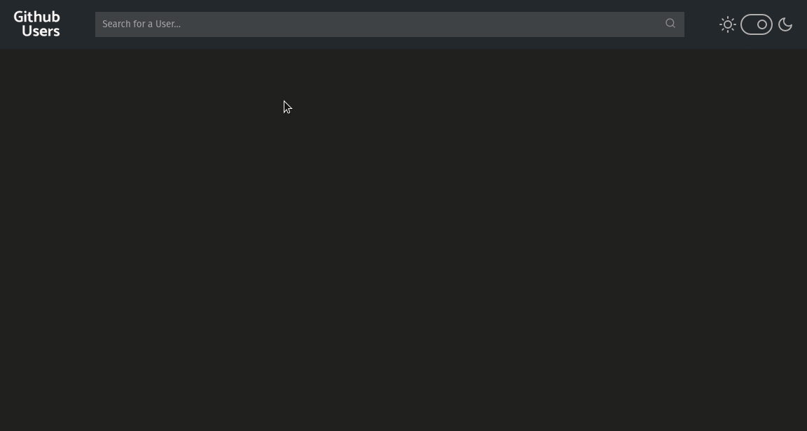

# Github Users

  
  

  <a href="#tecnologias">Tecnologias</a>&nbsp;&nbsp;&nbsp;|&nbsp;&nbsp;&nbsp;
  <a href="#deploy">Deploy</a>&nbsp;&nbsp;&nbsp;|&nbsp;&nbsp;&nbsp;
  <a href="#como-contribuir">Como contribuir</a>&nbsp;&nbsp;&nbsp;|&nbsp;&nbsp;&nbsp;
  <a href="#instalação-e-execução">Instalação e execução</a>&nbsp;&nbsp;&nbsp;|&nbsp;&nbsp;&nbsp;
  <a href="#licença">Licença</a>

  

## Tecnologias
- ReactJS
- Axios
- Styled Components
- API do Github

## Descrição
Github Users é uma aplicação que pesquisa os repositórios de um usuário do Github.

## Pré-requisito

[Node.js](https://nodejs.org/en/)

## Instalação e execução

1. Faça um clone desse repositório;
2. Entre na pasta "backend" `cd github-users`;
3. Execute `npm install` para instalar as dependencias;
4. Execute `npm start` para iniciar a aplicação;
5. Entre em [http://localhost:3000](http://localhost:3000);

## Como contribuir

- Faça um fork desse repositório;
- Cria uma branch com a sua feature: `git checkout -b minha-feature`;
- Faça commit das suas alterações: `git commit -m 'feat: Minha nova feature'`;
- Faça push para a sua branch: `git push origin minha-feature`.

Depois que o merge da sua pull request for feito, você pode deletar a sua branch.

## Deploy
### [Github Users](https://alexsrh.github.io/github-users-deploy//)

## Licença
Esse projeto está sob a licença MIT. Veja o arquivo [LICENSE](LICENSE) para mais detalhes.
